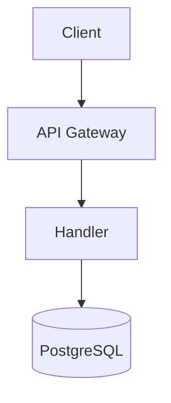

# CLAUDE.md

This file provides guidance to Claude Code when working with this repository.

## Project Overview

Lexicon Backend is a minimal Go API service using:

- **Chi router** for HTTP routing
- **SQLC** for type-safe PostgreSQL queries (handlers call SQLC directly)
- **oapi-codegen** for OpenAPI server generation
- **go-redis** for Redis
- **golang-migrate** for database migrations

The project also includes an **LLM service** (`llm/`) - a Python FastAPI service for AI-powered judicial deliberation using multi-agent architecture.

## Development Commands

### Go API

```bash
make install          # Install Go dependencies and tools
cp .env.example .env  # Create environment file (configure with shared infrastructure credentials)
# Ensure ../infrastructure/dokploy/compose/core is running (PostgreSQL, Redis)
make migrate-up       # Apply database migrations
make regenerate-all   # Generate API and DB code
make i18n-generate    # Regenerate i18n typed constants from TOML files
make api-dev          # Start server with hot reload
make test             # Run all tests
make check            # Run lint + test
```

### LLM Service (Python)

```bash
make llm-install      # Install Python dependencies (requires uv)
make llm-dev          # Start LLM service with hot reload (port 8004)
make llm-lint         # Run ruff linter
make llm-format       # Format code with ruff
make llm-test         # Run pytest
```

### Full Stack

```bash
make install-all      # Install both Go and Python dependencies
make dev-all          # Instructions to run both services
```

### Agent Worktrees

Use plain git worktrees for Codex and Claude Code. This repo keeps local
agent worktrees under `.codex/worktrees/` and `.claude/worktrees/`, both ignored
except for `.gitkeep`.

```bash
bash scripts/agent-worktree.sh create codex <branch-name> [from-branch]
bash scripts/agent-worktree.sh create claude <branch-name> [from-branch]
bash scripts/agent-worktree.sh setup  # run inside any Codex-managed or manual worktree
```

The setup script copies local `.env*` files from the primary checkout, runs
`git submodule update --init --recursive`, `npm ci`, `make install-all`, and
`make regenerate-all`. For cheaper reruns, pass `--skip-install` or
`--skip-generate`. In the Codex app, configure the local environment setup
script as `bash scripts/agent-worktree.sh setup`. Because this repo initializes
the `db` submodule, remove initialized worktrees with
`git worktree remove --force --force <path>`.

## Infrastructure

This backend connects to shared infrastructure services:

- **PostgreSQL**: `postgresql:5432`
- **Redis**: `redis:6379`

### Environment Variable Wiring

When adding a new runtime environment variable to `.env.example` or
`internal/config.Config`, also add it to every backend Compose environment block
used by production and staging. `.env` values are not automatically injected
into services unless the Compose file lists them (or an explicit `env_file` is
used). Local-only Makefile variables such as `DEV_DATABASE_URL`,
`PROD_DATABASE_URL`, `STAGING_DATABASE_URL`, and `TEST_DATABASE_URL` do not need
to be passed to the API container unless the container reads them at runtime.

## Key Patterns

### No Repository Pattern

Handlers call SQLC-generated queries directly. Example:

```go
func (s *Server) GetUser(w http.ResponseWriter, r *http.Request) {
    user, err := s.queries.GetUserByID(r.Context(), userID)
    // ...
}
```

### Extract Services When Needed

Start with logic in handlers. Extract to a service file when a handler exceeds ~100 lines. See **[docs/sop/007-service-extraction.md](docs/sop/007-service-extraction.md)** for the complete workflow and **[ADR-0010](docs/adr/0010-service-layer-extraction.md)** for the rationale.

### Database Changes

Schema files are auto-generated from migrations. See **[docs/sop/003-database-changes.md](docs/sop/003-database-changes.md)** for the complete workflow.

Quick reference:

1. Create migration: `make migrate-create name=add_foo`
2. Write UP/DOWN migration SQL
3. Generate schema: `make schema-generate`
4. Add queries to `internal/db/queries/*.sql`
5. Generate code: `make sqlc-generate`
6. Apply migration: `make migrate-up-dev`

### API-First Development (Important!)

**Always start with OpenAPI spec when making API changes.** See **[docs/sop/002-api-first-development.md](docs/sop/002-api-first-development.md)** for the complete workflow.

Quick reference:

1. **OpenAPI spec first** → `api/openapi.yaml`
2. **Regenerate code** → `make api-generate`
3. **Implement handlers** → Use generated types

### Internationalization (i18n)

All user-facing API responses must support Indonesian (default) and English. See **[docs/sop/001-i18n.md](docs/sop/001-i18n.md)** for the complete workflow.

Quick reference:

1. **Add keys** to `internal/i18n/locales/en.toml` and `id.toml`
2. **Generate constants** → `make i18n-generate`
3. **Use in handlers** → `i18n.T(ctx, i18n.MsgErrorKey)`
4. **For cache keys** → `i18n.LangFromCtx(ctx)` returns `"en"` or `"id"`

Language detection is handled by middleware (reads `Accept-Language` header). No per-endpoint configuration needed.

### Diagrams

**All documentation diagrams must use Mermaid notation.** See **[docs/sop/011-creating-diagrams.md](docs/sop/011-creating-diagrams.md)** for the complete workflow and **[ADR-0012](docs/adr/0012-mermaid-diagram-notation.md)** for the rationale.

Quick reference:

````markdown

````

| Diagram Type | Use For |
|--------------|---------|
| `graph TD` | Architecture, flowcharts |
| `sequenceDiagram` | API flows, request/response |
| `erDiagram` | Database schema |
| `stateDiagram-v2` | State machines, workflows |

## Architecture Principles

### Start Simple

- No repository pattern (SQLC is the repository)
- No services layer initially (handlers call SQLC directly)
- Flat configuration structure
- No premature abstractions

### When to Add Complexity

| Add This | When You See This |
|----------|-------------------|
| Services layer | Handler exceeds 100 lines |
| Repository pattern | SQLC becomes insufficient (unlikely) |
| Circuit breaker | LLM failure rate > 5% |
| Retry logic | Transient errors in production |
| NATS | Need async job processing |
| OpenTelemetry | Need distributed tracing |
| JWT/Sessions | Implementing authentication |

## Decision Making & Planning Guidelines

### Always Use AskUserQuestion When Creating Plans (Mandatory)

**Before creating any implementation plan, you MUST use the `AskUserQuestion` tool to:**

1. **Clarify requirements** - Confirm understanding of what the user wants
2. **Validate approach** - Present proposed solution direction for user approval
3. **Identify constraints** - Ask about any limitations, preferences, or existing patterns to follow
4. **Confirm scope** - Ensure alignment on what's included and excluded from the implementation

**This is non-negotiable.** Do not proceed with planning without first gathering user input through `AskUserQuestion`.

Example workflow:
```
User: "Add a new endpoint for user preferences"
Agent: [Uses AskUserQuestion to ask about:
  - What preferences need to be stored?
  - Should this use Redis caching?
  - Any authentication requirements?]
User: [Provides answers]
Agent: [Creates plan based on confirmed requirements]
```

### Planning Must Reference ADRs and SOPs

When creating implementation plans or making architectural decisions:

1. **Always consult existing ADRs** - Check [docs/adr/](docs/adr/) for established patterns and rationale
2. **Follow SOPs for workflows** - Use [docs/sop/](docs/sop/) for step-by-step procedures
3. **Align with architecture principles** - Ensure plans follow the simplicity-first approach (ADR-0004)

Example: Before planning a new caching feature, review ADR-0005 (Redis Caching Strategy) to ensure consistency.

### When to Ask for Confirmation

Use `AskUserQuestion` tool in these situations (in addition to plan creation):

| Situation | Action |
|-----------|--------|
| New architectural decision needed | Ask user to confirm approach before implementing |
| Deviation from existing ADR | Ask user if they want to proceed (may require new ADR) |
| Unclear which SOP applies | Ask user to clarify the workflow |
| Multiple valid approaches exist | Present options with trade-offs for user decision |
| Adding complexity (see table above) | Confirm with user before introducing new patterns |

**Never assume** - When in doubt about a decision that could affect architecture, caching, security, or API contracts, ask first.

### Creating New ADRs and SOPs

If work reveals a gap in documentation:

1. **New architectural decision** → Propose creating a new ADR, ask user for confirmation
2. **New workflow/procedure** → Propose creating a new SOP, ask user for confirmation
3. **Update existing docs** → Ask user before modifying established ADRs/SOPs

## What's NOT in This Project (Yet)

Add these when pain emerges:

- **Services layer** - when handlers get complex
- **NATS** - when async processing is needed
- **OpenTelemetry** - when debugging requires tracing
- **Circuit breaker/retry** - when LLM service shows high failure rate
- **JWT auth** - when authentication is implemented

## Code Generation

This project uses code generation for type safety and contract adherence:

- **SQLC**: Generates type-safe Go code from SQL queries
  - Configuration: `sqlc.yaml`
  - Schema source: `db/schemas/` (from git submodule)
  - Queries: `internal/db/queries/*.sql`
  - Output: `internal/db/sqlc/` (gitignored, regenerate with `make sqlc-generate`)

- **oapi-codegen**: Generates Chi server stubs from OpenAPI spec
  - Configuration: `oapi-codegen.yaml`
  - Output: `internal/api/api.gen.go` (gitignored, regenerate with `make api-generate`)

## Testing

Testing patterns are documented in **[docs/sop/006-test-execution.md](docs/sop/006-test-execution.md)**.

Quick reference:

| Command | Description |
|---------|-------------|
| `make test` | Run all tests (Go + Python) |
| `make test-go` | Run Go tests with race detection |
| `make llm-test` | Run Python LLM tests |
| `make check` | Run lint + test (pre-push gate) |

Key patterns:
- Use `httptest` from stdlib for handler tests
- Use `miniredis` for Redis-dependent tests
- Use table-driven tests for multiple scenarios
- Integration tests use docker-compose services

### Feature Testing Workflow (Agent Requirement)

**When the user asks to "test a feature", follow this complete workflow:**

1. **Write unit tests** for the feature in `*_test.go` files
2. **Run manual integration tests** using curl or similar tools
3. **Create a test execution report** in `docs/reports/TEST_EXECUTION_REPORT_<FEATURE>.md`
4. **Verify all tests pass** before marking complete

**Test Execution Report Template:**

See **[docs/sop/010-feature-testing-workflow.md](docs/sop/010-feature-testing-workflow.md)** for the full template. Key requirements:

- **Always include complete JSON response bodies** — never truncate or summarize
- Use `<details>` blocks to wrap verbose responses for readability
- Include environment info (Go version, branch, commit, DB/Redis health)
- Include cache validation results when endpoints use Redis caching
- Include error response bodies verbatim for error handling tests
- Group tests by endpoint, then by category (happy path, error handling, cache)

```markdown
# Test Execution Report: <Feature Name>

**Generated:** YYYY-MM-DD
**Branch:** feature/branch-name
**Base URL:** http://localhost:<PORT>
**Status:** ✅ ALL TESTS PASSED | ❌ TESTS FAILED

## Summary
| Category | Tests | Passed | Failed | Avg Response Time |
|----------|-------|--------|--------|-------------------|
| Happy Path | X | X | 0 | X.XXXs |
| Error Handling | X | X | 0 | X.XXXs |
| Cache Validation | X | X | 0 | X.XXXs |
| **Total** | **X** | **X** | **0** | **X.XXXs** |

## Environment
| Item | Value |
|------|-------|
| Go Version | <go version> |
| Branch | <branch> |
| Commit | <short SHA> |
| Database | <healthy/unhealthy (host:port/db)> |
| Redis | <healthy/unhealthy (host:port)> |

## Test Results
[Grouped by endpoint, with <details> blocks containing full request/response]

## Validation Checklist
[Status codes, Content-Type, error format, caching, response times]

## Commands Executed
[All curl commands used]

## Conclusion
[Summary and readiness assessment]
```

**Report naming convention:** `TEST_EXECUTION_REPORT_<FEATURE>.md` (e.g., `TEST_EXECUTION_REPORT_GRAPH.md`)

## Security

Security patterns are documented in **[docs/sop/005-security.md](docs/sop/005-security.md)** and **[ADR-0008](docs/adr/0008-security-middleware-stack.md)**.

Quick reference:

| Protection | Implementation |
|------------|----------------|
| SSRF | Secure HTTP client with host whitelist (`internal/httpclient/`) |
| SQL Injection | SQLC type-safe queries (never build SQL manually) |
| Rate limiting | 100 req/min per IP, fail-closed (Redis) |
| Bot detection | Multi-signal detection (headers, behavior, rate) with 429 blocking |
| Body size | 1MB max via middleware |
| Security headers | X-Frame-Options, HSTS, nosniff, Referrer-Policy |
| CORS | HTTPS-only in production, environment-aware origins |

**External HTTP calls must use `httpclient.NewSecureClient`** - this blocks private IPs and cloud metadata endpoints.

### Admin Authentication

Admin auth now has two layers of documentation. **[ADR-0017](docs/adr/0017-admin-authz-rbac.md)** covers Bearer-token verification and RBAC. **[ADR-0019](docs/adr/0019-admin-bff-auth.md)** covers the browser-facing BFF flow (`/v1/admin/auth/login`, `/callback`, `/logout`), opaque `admin_session` cookies, Redis-backed sessions, and server-side silent refresh against Authentik.

## Beneficial Ownership API Patterns

The beneficial ownership endpoints follow specific patterns for caching, validation, and type handling.

### Redis Caching

Chart endpoints use 5-minute TTL caching to reduce database load:

```go
cacheKey := "chart:countries"
if cached, err := s.redis.Get(ctx, cacheKey).Result(); err == nil {
    var items []ChartItem
    if err := json.Unmarshal([]byte(cached), &items); err == nil {
        return items  // Cache hit
    }
}

// Cache miss - query database
data, _ := s.queries.GetChartDataByCountries(ctx)

// Cache for 5 minutes
jsonData, _ := json.Marshal(data)
s.redis.Set(ctx, cacheKey, jsonData, 5*time.Minute)
```

**Cache keys:**

- `chart:countries` - Cases by country
- `chart:subject_types` - Cases by subject type
- `chart:case_types` - Cases by case type
- `lkpp:province` - LKPP blacklist by province
- `lkpp:ceiling` - LKPP ceiling distribution
- `lkpp:reporters` - LKPP top reporters
- `lkpp:scenario` - LKPP scenario distribution
- `lkpp:violation` - LKPP violation distribution

### ULID Validation

Case IDs use ULID format for sortable, unique identifiers:

- Format: 26 characters, base32 encoding
- Character set: `0-9A-HJKMNP-TV-Z` (excludes I, L, O, U)
- Pattern: `^[0-9A-HJKMNP-TV-Z]{26}$`

### Year Range Limits

Search endpoint enforces year range constraints:

- Minimum year: 1900
- Maximum year: 2100
- Maximum range span: 50 years
- Format: `YYYY-YYYY` (e.g., `2020-2023`)

### Type Mapping

Database integer codes map to string enums for the API:

**Subject Types:**

- 1 → `individual`
- 2 → `company`
- 3 → `organization`

**Case Types:**

- 1 → `verdict`
- 2 → `blacklist`
- 3 → `sanction`

**Status:**

- 0 → `deleted`
- 1 → `validated`
- 2 → `draft`

### Case-Insensitive Filtering Patterns

The codebase uses two strategies for case-insensitive filtering:

**Runtime Normalization (for low-cardinality fields)**

- Handler normalizes input: `strings.ToLower()`
- SQL uses `LOWER(column)` with function-based B-tree index
- Example: `nation` filtering in beneficial ownership search
- Use when: Field has < 1000 unique values

**Stored Normalized Column (for high-cardinality fields with fuzzy matching)**

- Database stores pre-normalized value in `{field}_normalized`
- SQL uses fuzzy matching: `similarity(subject_normalized, ...)`
- Example: `subject_normalized` in procurement blacklist matching
- Use when: Fuzzy matching needed or > 1000 unique values

**Convention:** Prefer `LOWER()` over `UPPER()` for consistency.

### Chatbot Integration

The chatbot proxy uses query parameters (not JSON body) to match the service's interface:

```go
params := url.Values{}
params.Add("thread_id", req.ThreadId)
params.Add("user_message", req.UserMessage)
httpReq.URL.RawQuery = params.Encode()
```

This fixes a bug in the original implementation that incorrectly used JSON encoding.

### Array-Based SQL Filtering

Search queries use PostgreSQL's `ANY(array)` operator for safe filtering:

```sql
AND (cardinality($1::int[]) = 0 OR subject_type = ANY($1::int[]))
```

This approach:

- Prevents SQL injection
- Allows empty arrays (no filter)
- Handles multiple values efficiently

### CASE Expression Handling

SQLC generates `interface{}` types for CASE expressions (since return types can vary):

```go
// Helper to convert nullable interface{} to string
func convertLabel(label interface{}) string {
    if label == nil {
        return ""
    }
    if str, ok := label.(string); ok {
        return str
    }
    return fmt.Sprintf("%v", label)
}
```

Use this when mapping chart data from SQLC queries.

## References

### ADRs (Architectural Decision Records)

Documents capturing key architectural decisions and their rationale: **[docs/adr/](docs/adr/)**

Key decisions documented:
- [ADR-0001](docs/adr/0001-technology-stack-selection.md): Technology Stack (Chi, SQLC, PostgreSQL, Redis)
- [ADR-0002](docs/adr/0002-direct-sqlc-access.md): Direct SQLC Access (no repository pattern)
- [ADR-0003](docs/adr/0003-api-first-development.md): API-First Development
- [ADR-0004](docs/adr/0004-simplicity-first-architecture.md): Simplicity-First Architecture
- [ADR-0005](docs/adr/0005-redis-caching-strategy.md): Redis Caching Strategy
- [ADR-0006](docs/adr/0006-internationalization-approach.md): Internationalization (i18n)
- [ADR-0007](docs/adr/0007-llm-service-separation.md): LLM Service Separation
- [ADR-0008](docs/adr/0008-security-middleware-stack.md): Security Middleware Stack
- [ADR-0009](docs/adr/0009-logging-and-opentelemetry-observability.md): Logging and OpenTelemetry
- [ADR-0010](docs/adr/0010-service-layer-extraction.md): Service Layer Extraction
- [ADR-0011](docs/adr/0011-llm-multi-agent-deliberation.md): LLM Multi-Agent Deliberation
- [ADR-0012](docs/adr/0012-mermaid-diagram-notation.md): Mermaid Diagram Notation
- [ADR-0015](docs/adr/0015-bot-detection-middleware.md): Bot Detection Middleware
- [ADR-0016](docs/adr/0016-deliberation-engine-overhaul.md): Deliberation Engine Overhaul
- [ADR-0017](docs/adr/0017-admin-authz-rbac.md): Admin Authorization RBAC
- [ADR-0018](docs/adr/0018-crawler-admin-reverse-proxy.md): Crawler Admin Reverse Proxy
- [ADR-0019](docs/adr/0019-admin-bff-auth.md): Admin BFF Authentication

### SOPs (Standard Operating Procedures)

Detailed workflows for common tasks: **[docs/sop/](docs/sop/)**

### Reference Documentation

In-depth component guides: **[docs/reference/](docs/reference/)**

- [LLM Agent Personalities](docs/reference/llm-agent-personalities.md): Judicial agent philosophies and tuning

### Internal

- Dataminer patterns: `/Users/adryanev/Code/lexicon/dataminer/`
- Infrastructure docs: `/Users/adryanev/Code/lexicon/infrastructure/README.md`

### External

- Chi: <https://go-chi.io/>
- SQLC: <https://docs.sqlc.dev/>
- oapi-codegen: <https://github.com/oapi-codegen/oapi-codegen>
- golang-migrate: <https://github.com/golang-migrate/migrate>


<claude-mem-context>
# Memory Context

# [backend/providence] recent context, 2026-04-29 3:12am GMT+7

Legend: 🎯session 🔴bugfix 🟣feature 🔄refactor ✅change 🔵discovery ⚖️decision 🚨security_alert 🔐security_note
Format: ID TIME TYPE TITLE
Fetch details: get_observations([IDs]) | Search: mem-search skill

Stats: 29 obs (10,358t read) | 665,892t work | 98% savings

### Apr 29, 2026
1005 2:30a 🔵 Providence Backend Code Review Initiated
1006 " 🟣 SSE Streaming Added to Council Session Creation Endpoint
1007 " ✅ Council Agent Names Renamed in API Examples (humanist→humanis, strict→legalis)
1008 " 🔵 Providence Backend PR Scope: 34 Files, 3482 Insertions, SSE + Identity Agent + Tests
1009 2:31a 🟣 New Agent Identity Module Decouples Indonesian Public Names from Internal AgentId Enum
1010 " 🟣 SSE Streaming Generator Implemented in Python Session Router
1011 " 🟣 Orchestrator Gains generate_random_initial_opinion_stream() for Chunk-Level SSE
1012 " 🟣 Go Handler acceptsEventStream() Parses Accept Header with Quality Value Support
1013 " ✅ Council Agent target_agent Enum Expanded with Indonesian Aliases in OpenAPI Schema
1014 2:32a 🔄 BaseJudgeAgent LLM Context Fully Localized to Indonesian
1015 " 🔄 Classifier Now Uses Shared Identity Module for Agent Enum Values and Pattern Matching
1016 " 🔴 CaseDatabase Similar-Case Search Fixed for Bilingual Case-Type Filters
1018 " 🟣 New Test Suite for SSE Session Creation Stream Validates Full Event Sequence
1019 " 🔄 Capabilities Endpoint Agent Names and Descriptions Localized to Indonesian
1017 " 🔄 PDF Generator Fully Localized to Indonesian with Safe HTML Escaping
1020 2:34a 🔴 Deliberation Router Fixes Target Agent Priority: Explicit Request Overrides Classifier Routing
1021 " 🟣 PDF Generator Test Suite Added for Indonesian Localization
1022 " 🔄 All Agent Classes Renamed agent_name to Indonesian and Updated Cross-References in System Prompts
1023 " 🟣 Case Parser Instructed to Output Indonesian Strings in Extracted Fields
1024 " 🟣 Generated Models Extended with SSE Event Types and Indonesian TargetAgent Enum Values
1025 " 🟣 Orchestrator Test Verifies Indonesian Alias Resolution in determine_response_order
1026 2:35a 🟣 Classifier Tests Extended for Indonesian Alias Detection and parse_agent_id
1027 " 🟣 Database Tests Verify Bilingual Case-Type Filter Expansion and Deduplication
1028 " 🟣 Deliberation Router Tests Expanded with Target Priority, Alias Normalization, and stream_initial Exclusion Logic
1029 " 🔵 stream_initial_opinions Filters Judges Who Already Spoke — Critical SSE Integration Point
1030 " 🟣 TestCreateCouncilSession Go handler tests passing
1031 2:39a 🔴 SSE create-session failure semantics aligned with JSON path
1032 " 🔄 PDF generator English→Indonesian fallback layer fully removed
1033 " 🟣 OpenAPI spec updated with SSE streaming and Indonesian agent aliases
S180 Create PR for lexicon-backend: SSE council session creation + Indonesian agent identities; then address Gemini review items (Apr 29 at 2:50 AM)
S179 Create PR for lexicon-backend workspace diff: SSE council session creation + Indonesian agent identities (legalis/humanis/sejarawan) (Apr 29 at 2:50 AM)
S181 Fix ruff E501 blocker in database.py and complete commit+push of performance improvements (ILIKE ANY case_type filter + hoisted localization map) (Apr 29 at 2:54 AM)
**Investigated**: - Confirmed 7 files staged: internal/db/queries/llm_extractions.sql, internal/db/sqlc/llm_extractions.sql.go, internal/db/sqlc/querier.go, llm/src/council/agents/base.py, llm/src/council/database.py, llm/src/council/db/sqlc/extraction/llm_extractions.py, llm/tests/test_database.py
    - Identified exact ruff E501 location: database.py:868, `async for row in querier.find_similar_cases_by_embedding_with_filter(` at 89 chars (1 over 88 limit)
    - Confirmed two prior commit attempts both failed on the same E501 (ruff format+fix runs but E501 is not auto-fixable)

**Learned**: - ruff E501 cannot be auto-fixed by ruff format; the line must be manually restructured
    - The pre-commit hook dance (fixers modify files then exit non-zero) does not help for E501 — the second `git commit` still fails
    - Splitting the async comprehension by assigning the async iterator to a `stream` variable first: `stream = querier.find_similar_cases_by_embedding_with_filter(...)` then `rows = [row async for row in stream]` eliminates the 89-char line entirely, keeping all lines under 88 chars
    - Python async generators can be assigned to a variable before being consumed in a comprehension — the generator is not eagerly evaluated at assignment time

**Completed**: - Fixed ruff E501 in database.py by restructuring the async comprehension: extracted `stream = querier.find_similar_cases_by_embedding_with_filter(dollar_1=..., limit=..., dollar_3=...)` before the comprehension, then `rows = [row async for row in stream]`
    - Committed all 7 files as `39c21c4` on branch `adryanev/korupsi-search` with message: `perf(council): one-shot ILIKE ANY for case_type + hoist localization map`; all pre-commit hooks passed (ruff format, ruff check, llm pytest)
    - Pushed `39c21c4` to `LexiconIndonesia/backend` remote, updating the PR branch (339785e → 39c21c4)
    - All 5 reviewer comments from PR are now resolved: PDF literal brittleness (fixed in prior commit), SSE failure semantics (fixed in prior commit), N+1 filter queries → ILIKE ANY (fixed in this commit), per-call dict allocation → module-level constant (fixed in this commit), plus informational walkthrough (no action)

**Next Steps**: No active work remaining. All Gemini code review follow-up tasks (Task #8: ILIKE ANY, Task #9: hoist localization map) are shipped and the PR branch is up to date. Session can continue with new requests.


Access 666k tokens of past work via get_observations([IDs]) or mem-search skill.
</claude-mem-context>
